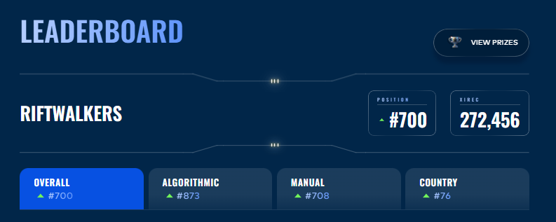
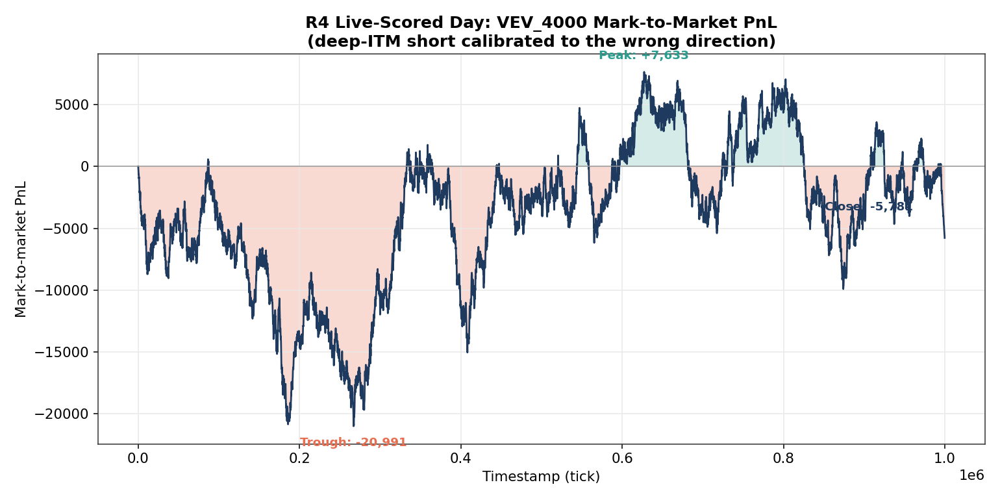

# IMC Prosperity 4: Team RiftWalkers

[](https://github.com/aryaarun0910-debug/IMC-Prosperity-4-RiftWalkers/actions/workflows/ci.yml)
[](LICENSE)


-success)


Two of us played **IMC Prosperity 4** end to end: [IMC Trading](https://www.imc.com/)'s five-round global algorithmic and manual trading competition. 18,803 teams entered. This is our full, honest writeup of the run.

> **76th in the UK · 700th of 18,803 globally (top 3.7%) · Manual Round 1: 6th in the world.**

| | Global | UK | Algorithmic | Manual |
|---|---|---|---|---|
| **Final rank** | #700 | **#76** | #873 | #708 |

*Cumulative score: 272,456 XIRECs.*




The chart above is the competition in one image: the algorithm that scored highest on the single-day check (left) lost money on a different day, while the cross-day-validated approach (right) was an order of magnitude more robust. Recognizing that distinction (signal versus fit) is the throughline of this repository.

---

## About

**IMC Prosperity** is a multi-week quantitative trading competition run by the market maker [IMC Trading](https://www.imc.com/), open to tens of thousands of teams: students, quants, professionals. Prosperity 4 ran **five rounds with 18,803 teams**. Each round has two parts: an **algorithmic** challenge (an autonomous trading program against bot counterparties on a simulated exchange) and a **manual** challenge (a one-shot game-theoretic or quantitative puzzle). It rewards breadth: market making, options, statistical arbitrage, optimization, game theory, under hard engineering constraints.

**RiftWalkers**, a two-person team, finished **700th of 18,803 globally (top 3.7%), 76th in the UK**, with **6th in the world** on the Round 1 manual challenge.

This repository documents all five rounds end to end: the products, the strategies, the underlying mathematics, the results, and an honest analysis of what worked and what did not. The algorithmic side is a single-file, standard-library-only Python trading engine; the manual side is a set of from-first-principles solutions to game-theoretic and quantitative problems; supporting both is a custom back testing, walk-forward validation and signal-research pipeline. The work spans market microstructure, options pricing, time-series modeling, Bayesian methods, game theory, and constrained optimization, all implemented and validated from scratch.

---

## Quickstart

The submission engine is standard-library only by competition rule. The research tooling and this demo use scientific Python.

```bash
git clone https://github.com/aryaarun0910-debug/IMC-Prosperity-4-RiftWalkers.git
cd IMC-Prosperity-4-RiftWalkers
pip install -r requirements.txt

python demo.py            # run the Round 5 engine on synthetic data, end to end
pytest tests/ -q          # 17 unit tests: position limits, z-score, Black-Scholes
python analysis/generate_repo_charts.py   # regenerate the figures in docs/assets
```

The real competition data is large and not included (see `.gitignore`); `demo.py` generates a synthetic mean-reverting series with the same order-book schema so the engine can be run and inspected without it.

---

## Results by round

| Round | Phase | Cumulative XIRECs | Algo PnL | Algo Rank | Manual PnL | Manual Rank |
|-------|-------|-------------------|----------|-----------|------------|-------------|
| R1 | Qualifier | 183,387 | +95,490 | 1642 | +87,897 | **6** |
| R2 | Qualifier | 444,349 | +73,268 | 3407 | +187,694 | 128 |
| R3 | Final | 133,190 | +65,477 | 504 | +67,713 | 541 |
| R4 | Final | 176,419 | +19,664 | 1265 | +23,566 | 699 |
| R5 | Final | 272,456 | +6,849 | 896 | +89,187 | 411 |

*Phase 2 (R3–R5) began with a full leaderboard reset; Phase-1 PnL did not carry forward.*


The manual track consistently outperformed the algorithmic track in relative ranking, a contrast the round writeups examine directly.


---

## Documentation

| Document | Focus |
|----------|-------|
| [Competition Overview](docs/01-competition-overview.md) | Exchange model, rules, two-phase structure, scoring |
| [Round 1](docs/02-round1.md) | Market-making foundations; AR + informed-trader signal; Manual R1 |
| [Round 2](docs/03-round2.md) | Qualifier strategy; game-theoretic manual round |
| [Round 3](docs/04-round3.md) | Options and volatility: implied-vol scalping, vol-smile fitting |
| [Round 4](docs/05-round4.md) | Exotic options pricing; the algorithmic overfitting failure |
| [Round 5](docs/06-round5.md) | 50 new products and signal discovery; news-driven manual portfolio |
| [Manual Rounds](docs/07-manual-rounds.md) | The mathematics behind the strongest results |
| [Pipeline Architecture](docs/08-pipeline-architecture.md) | Trading engine and research/validation tooling |
| [Overfitting Analysis](docs/09-overfitting-lessons.md) | The central technical finding, with data |
| [Retrospective](docs/10-retrospective.md) | What worked, what did not, and where the remaining edge is |
| [Quantitative Analysis](docs/11-quantitative-analysis.md) | Correlation structure, volatility, risk, and the options vol surface |
| [Engineering Practices](docs/12-engineering-practices.md) | Constraint-driven design, testing, CI, reproducibility, validation discipline |

Source code is mapped in [`src/README.md`](src/README.md).

---

## The trading engine

A single self-contained `trader.py` (standard library only: numpy, pandas, and scipy are disallowed in submissions) that routes each product to a strategy handler, either statically pre-configured per round or auto-classified at runtime. The archetypes that actually fired on real Prosperity 4 products:

| Strategy | Application | Products |
|----------|-------------|----------|
| `pegged` | Stable-value / drifting products: sweep-all liquidity plus overbid/undercut market making | ASH_COATED_OSMIUM, INTARIAN_PEPPER_ROOT (R1), HYDROGEL_PACK, VELVETFRUIT_EXTRACT (R3/R4) |
| `voucher_intrinsic_mm` | Deep-ITM voucher market making at intrinsic value, delta-hedged to the underlying | VEV_4000 (R3/R4) |
| `otm_short` | OTM voucher theta-decay short, sized off a computed decay table | VEV_5100–5500 (R3/R4) |
| `generic_mm` | Runtime fallback for auto-classified products that don't fit a specific pattern | (fallback only) |
| `do_nothing` | Explicit sit-out where testing showed no edge | VEV_4500, VEV_5000, VEV_6000, VEV_6500 |
| single-asset z-score mean reversion | Momentum-filtered mean reversion (separate, purpose-built engine: `trader_r5.py`) | R5's 50-product set (PEBBLES_XL etc.) |

**Known limitation.** The engine also defines a runtime classifier, `classify_product_live()`, that uses real statistical criteria (autocorrelation, price range, spread width, basket/cointegration detection) to assign a strategy to any unrecognized product, and it can assign `ar_olivia`, `olivia_follow`, `wide_spread`, `basket_arb`, `conversion_arb`, `pairs_arb`, or even the literal `options` tag. All seven of those resolve to a no-op (`orders = []`) in the actual dispatch table: built, classifiable, but never wired to real trading logic. This never affected real results, since every product that mattered was statically pre-configured before each round started, bypassing the classifier, but it's a genuine gap in the fallback path had an unclassified product appeared live. Full detail in [Pipeline Architecture](docs/08-pipeline-architecture.md).

Supporting infrastructure includes Bayesian Online Changepoint Detection for regime shifts, trim-based position-limit enforcement, markout-driven adverse-selection sizing, and a runtime product classifier. Every model (Black-Scholes, implied-volatility inversion, Kalman filtering, AR regression, changepoint detection) is implemented in pure Python to satisfy the submission constraints. Details in [Pipeline Architecture](docs/08-pipeline-architecture.md).

The nine archetypes are thin handlers over a shared infrastructure core. The dependency topology shows position-limit enforcement as the universal hub, with fair-value estimation and markout sizing as secondary hubs:


---

## Selected analysis

Every figure below is generated from the real competition data ([`analysis/generate_quant_charts.py`](analysis/generate_quant_charts.py)). The full treatment is in [Quantitative Analysis](docs/11-quantitative-analysis.md).

**Cross-sectional structure.** The Round 5 signal hunt began by asking which of 50 products moved together. Two categories had clean, cross-day-stable structure (a two-factor SnackPacks system and a single-factor Pebbles system), and the rest were noise. That selection drove every relative-value decision.


**Where the edge lives.** Sweeping the mean-reversion parameters over a grid produces a smooth PnL surface with a broad plateau, not a sharp spike. Shipping inside the plateau rather than on the peak is a deliberate trade of in-sample PnL for out-of-sample robustness.

**Why robustness matters.** Taking each product's best in-sample configuration and testing it on a held-out day shows the core lesson of the competition: a large fraction of strong-in-training products lose money on the unseen day. Only the survivors are worth shipping, and they are not the highest-training-PnL ones.


**Risk, not just PnL.** The equity curve, drawdown profile, and per-tick return distribution for the headline strategy show steady accumulation, contained drawdown, and controlled tails. PEBBLES_XL mean-reversion, concatenated across the three R5 days: **final PnL 81,450**, **max drawdown −27,740**, **annualized Sharpe ≈ 2.0** (computed in [`analysis/generate_quant_charts.py`](analysis/generate_quant_charts.py), `risk_analysis()`).


**Options.** Inverting Black-Scholes on the Round 4 voucher prices recovers a well-formed, cross-day-stable implied-volatility smile, the basis for trading relative mispricing across strikes rather than absolute price.


**The overfitting failure, in real data.** The clearest single lesson of the competition, shown rather than just described: VEV_4000's actual tick-by-tick mark-to-market PnL on the live-scored R4 day, from a deep-ITM short position calibrated to a development day that drifted down, hit by a scoring day that spiked intraday instead. Peak +7,633 XIRECs, trough −20,991 XIRECs, close −5,781 XIRECs, from the real submission log (total algo profit 19,663.66 XIRECs, matching the reported 19,664 XIRECs). Full writeup: [Round 4](docs/05-round4.md) · [Overfitting Analysis](docs/09-overfitting-lessons.md).



---

## Reflection

Five rounds, two people and a leaderboard that reset halfway through. The clearest pattern in our own results is the gap between the two tracks: the manual side (where every decision came from a model we built and could defend from first principles) consistently finished near the top of the field, while the algorithmic side (where we were modeling a market we could observe for only a few days) was where we got hurt.

The lesson we keep returning to is the one Round 4 taught expensively: a strategy that only works on the data it was fit to is not a strategy. The discipline that came out of it (cross-day validation, preferring broad parameter optima over sharp peaks, distrusting a single good day) is the most transferable thing we took from the competition, and it is why these writeups spend as much time on the losses as on the wins.

---

## Contributors

Arya Arun and Chris Legge  

