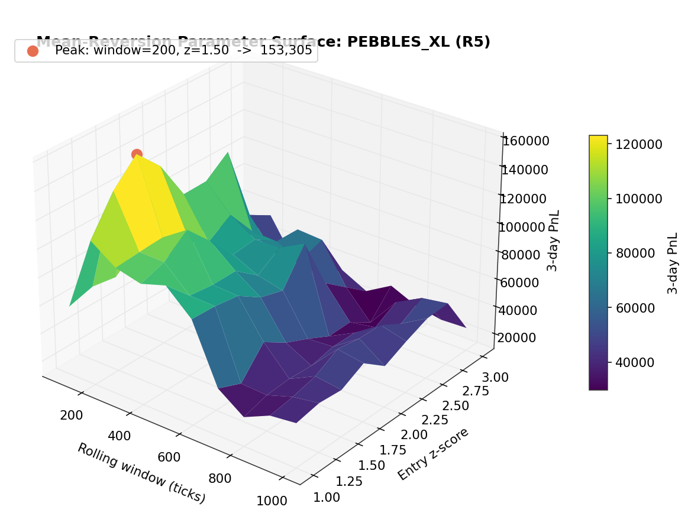

# IMC Prosperity 4 — Team RiftWalkers

[](https://github.com/aryaarun0910-debug/IMC-Prosperity-4-RiftWalkers/actions/workflows/ci.yml)
[](LICENSE)


-success)


A complete, candid record of a two-person team's run through **IMC Prosperity 4** — a five-round global algorithmic and manual trading competition run by [IMC Trading](https://www.imc.com/), with 18,803 participating teams.

> **76th in the UK · 700th of 18,803 globally (top 3.7%) · Manual Round 1: 6th in the world.**

| | Global | UK | Algorithmic | Manual |
|---|---|---|---|---|
| **Final rank** | #700 | **#76** | #873 | #708 |

*Cumulative score: 272,456 XIRECs.*


The chart above is the competition in one image: the algorithm that scored highest on the single-day check (left) lost money on a different day, while the cross-day-validated approach (right) was an order of magnitude more robust. Recognizing that distinction — signal versus fit — is the throughline of this repository.

---

## About

**IMC Prosperity** is one of the largest quantitative trading competitions in the world — a multi-week tournament run by the market-making firm [IMC Trading](https://www.imc.com/), drawing tens of thousands of teams of students, quants, and professionals. Prosperity 4 ran across **five rounds with 18,803 teams**, each round combining an **algorithmic** challenge (an autonomous trading program run against bot counterparties on a simulated exchange) with a **manual** challenge (a one-shot game-theoretic or quantitative puzzle). It rewards breadth — market making, options, statistical arbitrage, optimization, game theory — under hard engineering constraints.

**RiftWalkers** was a two-person team that finished **700th of 18,803 globally (top 3.7%), 76th in the UK**, with a **6th-in-the-world** result on the Round 1 manual challenge.

This repository documents all five rounds end to end — the products, the strategies, the underlying mathematics, the results, and a deliberately honest analysis of what worked and what did not. The algorithmic side is a single-file, standard-library-only Python trading engine; the manual side is a set of from-first-principles solutions to game-theoretic and quantitative problems; supporting both is a custom backtesting, walk-forward validation, and signal-research pipeline. The work spans market microstructure, options pricing, time-series modeling, Bayesian methods, game theory, and constrained optimization — all implemented and validated from scratch.

---

## Quickstart

The submission engine is standard-library only by competition rule. The research tooling and this demo use scientific Python.

```bash
git clone https://github.com/aryaarun0910-debug/IMC-Prosperity-4-RiftWalkers.git
cd IMC-Prosperity-4-RiftWalkers
pip install -r requirements.txt

python demo.py            # run the Round 5 engine on synthetic data, end to end
pytest tests/ -q          # 17 unit tests: position limits, z-score, Black-Scholes
python analysis/generate_repo_charts.py   # regenerate the figures in docs/assets
```

The real competition data is large and not included (see `.gitignore`); `demo.py` generates a synthetic mean-reverting series with the same order-book schema so the engine can be run and inspected without it.

---

## Results by round

| Round | Phase | Cumulative XIRECs | Algo PnL | Algo Rank | Manual PnL | Manual Rank |
|-------|-------|-------------------|----------|-----------|------------|-------------|
| R1 | Qualifier | 183,387 | +95,490 | 1642 | +87,897 | **6** |
| R2 | Qualifier | 444,349 | +73,268 | 3407 | +187,694 | 128 |
| R3 | Final | 133,190 | +65,477 | 504 | +67,713 | 541 |
| R4 | Final | 176,419 | +19,664 | 1265 | +23,566 | 699 |
| R5 | Final | 272,456 | +6,849 | 896 | +89,187 | 411 |

*Phase 2 (R3–R5) began with a full leaderboard reset; Phase-1 PnL did not carry forward.*


The manual track consistently outperformed the algorithmic track in relative ranking — the contrast that the round writeups examine directly.


---

## Documentation

| Document | Focus |
|----------|-------|
| [Competition Overview](docs/01-competition-overview.md) | Exchange model, rules, two-phase structure, scoring |
| [Round 1](docs/02-round1.md) | Market-making foundations; AR + informed-trader signal; Manual R1 |
| [Round 2](docs/03-round2.md) | Qualifier strategy; game-theoretic manual round |
| [Round 3](docs/04-round3.md) | Options and volatility — implied-vol scalping, vol-smile fitting |
| [Round 4](docs/05-round4.md) | Exotic options pricing; the algorithmic overfitting failure |
| [Round 5](docs/06-round5.md) | 50 new products and signal discovery; news-driven manual portfolio |
| [Manual Rounds](docs/07-manual-rounds.md) | The mathematics behind the strongest results |
| [Pipeline Architecture](docs/08-pipeline-architecture.md) | Trading engine and research/validation tooling |
| [Overfitting Analysis](docs/09-overfitting-lessons.md) | The central technical finding, with data |
| [Retrospective](docs/10-retrospective.md) | What worked, what did not, and where the remaining edge is |
| [Quantitative Analysis](docs/11-quantitative-analysis.md) | Correlation structure, volatility, risk, and the options vol surface |
| [Engineering Practices](docs/12-engineering-practices.md) | Constraint-driven design, testing, CI, reproducibility, validation discipline |

Source code is mapped in [`src/README.md`](src/README.md).

---

## The trading engine

A single self-contained `trader.py` (standard library only — numpy, pandas, and scipy are disallowed in submissions) implementing nine strategy archetypes, auto-dispatched per product:

| Strategy | Application |
|----------|-------------|
| `pegged` | Stable-value products — sweep-all liquidity plus overbid/undercut market making |
| `ar_olivia` | Trending products — AR(p) on returns, Kalman filtering, informed-trader detection |
| `olivia_follow` | Signal-following with no passive quoting |
| `wide_spread` | High-volatility products — EMA-based wide market making |
| `basket_arb` | Index/component arbitrage — z-score entry with partial hedging |
| `conversion_arb` | Cross-market arbitrage with environmental factors |
| `options` | Implied-vol scalping and mean-reversion with kill-switch controls |
| `pairs_arb` | Cointegrated pairs trading |
| `generic_mm` | Fallback adaptive market making |

The engine implements all nine archetypes (developed across the practice round and prior-year reference data); the live Prosperity 4 rounds exercised a subset — `pegged` market making on the Round 1–4 cash products, `options` IV-scalping on the Round 3–4 vouchers, and a mean-reversion engine on the Round 5 product set.

Supporting infrastructure includes Bayesian Online Changepoint Detection for regime shifts, trim-based position-limit enforcement, markout-driven adverse-selection sizing, and a runtime product classifier. Every model — Black-Scholes, implied-volatility inversion, Kalman filtering, AR regression, changepoint detection — is implemented in pure Python to satisfy the submission constraints. Details in [Pipeline Architecture](docs/08-pipeline-architecture.md).

The nine archetypes are thin handlers over a shared infrastructure core. The dependency topology shows position-limit enforcement as the universal hub, with fair-value estimation and markout sizing as secondary hubs:


---

## Selected analysis

Every figure below is generated from the real competition data ([`analysis/generate_quant_charts.py`](analysis/generate_quant_charts.py)). The full treatment is in [Quantitative Analysis](docs/11-quantitative-analysis.md).

**Cross-sectional structure.** The Round 5 signal hunt began by asking which of 50 products moved together. Two categories had clean, cross-day-stable structure — a two-factor SnackPacks system and a single-factor Pebbles system — and the rest were noise. That selection drove every relative-value decision.


**Where the edge lives.** Sweeping the mean-reversion parameters over a grid produces a smooth PnL surface with a broad plateau, not a sharp spike. Shipping inside the plateau rather than on the peak is a deliberate trade of in-sample PnL for out-of-sample robustness.



**Why robustness matters.** Taking each product's best in-sample configuration and testing it on a held-out day shows the core lesson of the competition: a large fraction of strong-in-training products lose money on the unseen day. Only the survivors are worth shipping — and they are not the highest-training-PnL ones.


**Risk, not just PnL.** The equity curve, drawdown profile, and per-tick return distribution for the headline strategy — steady accumulation, contained drawdown, controlled tails.


**Options.** Inverting Black-Scholes on the Round 4 voucher prices recovers a well-formed, cross-day-stable implied-volatility smile — the basis for trading relative mispricing across strikes rather than absolute price.


---

## Methods

Statistical arbitrage · market microstructure · options pricing (Black-Scholes, implied-volatility inversion) · Kalman filtering · autoregressive time-series modeling · Bayesian changepoint detection · game theory and equilibrium analysis · constrained optimization (Lagrangian, Kelly-style sizing) · Monte-Carlo simulation · walk-forward validation.

---

## Reflection

Five rounds, two people, and a leaderboard that reset halfway through. The clearest pattern in our own results is the gap between the two tracks: the manual side — where every decision came from a model we built and could defend from first principles — consistently finished near the top of the field, while the algorithmic side — where we were modeling a market we could observe for only a few days — was where we got hurt.

The lesson we keep returning to is the one Round 4 taught expensively: a strategy that only works on the data it was fit to is not a strategy. The discipline that came out of it — cross-day validation, preferring broad parameter optima over sharp peaks, distrusting a single good day — is the most transferable thing we took from the competition, and it is why these writeups spend as much time on the losses as on the wins.

If we ran it again, the effort would go where the evidence says it should: less time tuning parameters the data shows don't matter, more time on what a signal actually *is* and whether it survives out of sample. Finishing in the top 4% of 18,803 teams was a result we were glad of — but the honest account of how we got there, mistakes included, is the part worth keeping.

---

## Contributors

A two-person team (Chris Legge and Arya Arun). See individual round documents for the work split between the algorithmic and manual tracks.

This repository is a retrospective compiled after the competition closed; all figures are the official final results. The writeups are deliberately candid about failures — particularly the Round 4 algorithmic loss and its root cause — because the analysis of those failures is the most transferable part of the work.
