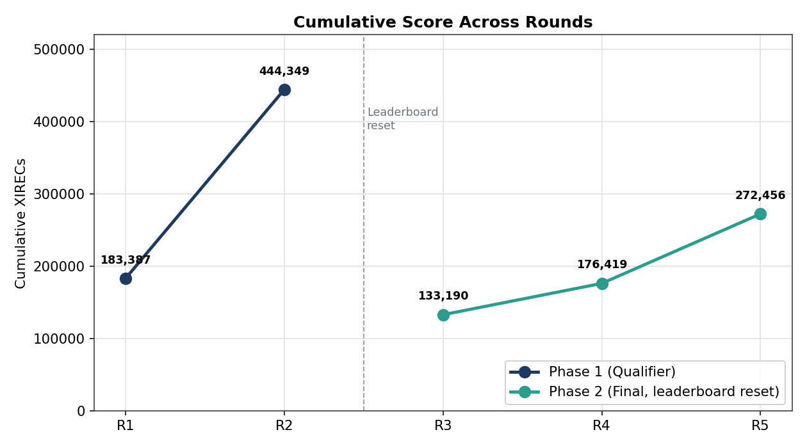
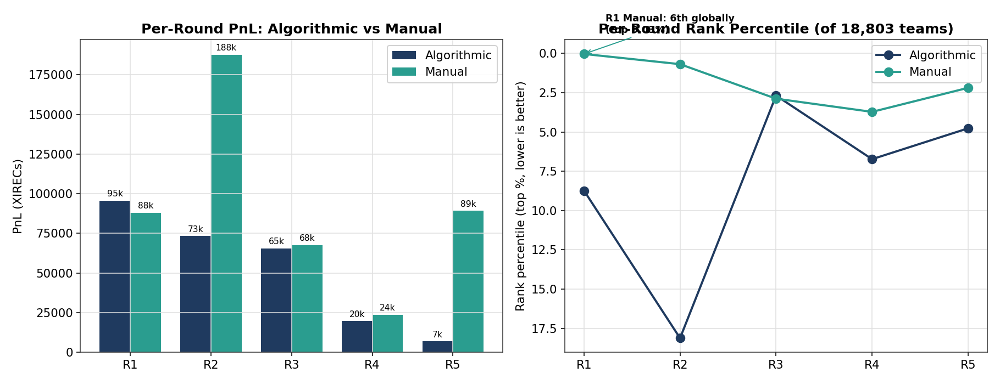

# IMC Prosperity 4 — Team RiftWalkers

[](https://github.com/aryaarun0910-debug/IMC-Prosperity-4-RiftWalkers/actions/workflows/ci.yml)
[](LICENSE)


-success)


A complete, candid record of a two-person team's run through **IMC Prosperity 4** — a five-round global algorithmic and manual trading competition run by [IMC Trading](https://www.imc.com/), with 18,803 participating teams.

> **76th in the UK · 700th of 18,803 globally (top 3.7%) · Manual Round 1: 6th in the world.**

| | Global | UK | Algorithmic | Manual |
|---|---|---|---|---|
| **Final rank** | #700 | **#76** | #873 | #708 |

*Cumulative score: 272,456 XIRECs.*


The chart above is the competition in one image: the algorithm that scored highest on the single-day check (left) lost money on a different day, while the cross-day-validated approach (right) was an order of magnitude more robust. Recognizing that distinction — signal versus fit — is the throughline of this repository.

---

## About

RiftWalkers was a two-person team competing across both tracks of Prosperity 4: an autonomous **algorithmic** trading engine and a series of one-shot **manual** trading puzzles. This repository documents all five rounds end to end — the products, the strategies, the underlying mathematics, the results, and a deliberately honest analysis of what worked and what did not.

The algorithmic side is a single-file, standard-library-only Python trading engine implementing nine strategy archetypes (market making, statistical arbitrage, options, conversion arbitrage) on a discrete-tick exchange. The manual side is a set of from-first-principles solutions to game-theoretic and quantitative problems. Supporting both is a custom backtesting, walk-forward validation, and signal-research pipeline.

The work spans market microstructure, options pricing, time-series modeling, Bayesian methods, game theory, and constrained optimization — all implemented and validated from scratch.

---

## Quickstart

The submission engine is standard-library only by competition rule. The research tooling and this demo use scientific Python.

```bash
git clone https://github.com/aryaarun0910-debug/IMC-Prosperity-4-RiftWalkers.git
cd IMC-Prosperity-4-RiftWalkers
pip install -r requirements.txt

python demo.py            # run the Round 5 engine on synthetic data, end to end
pytest tests/ -q          # 17 unit tests: position limits, z-score, Black-Scholes
python analysis/generate_repo_charts.py   # regenerate the figures in docs/assets
```

The real competition data is large and not included (see `.gitignore`); `demo.py` generates a synthetic mean-reverting series with the same order-book schema so the engine can be run and inspected without it.

---

## Results by round

| Round | Phase | Cumulative XIRECs | Algo PnL | Algo Rank | Manual PnL | Manual Rank |
|-------|-------|-------------------|----------|-----------|------------|-------------|
| R1 | Qualifier | 183,387 | +95,490 | 1642 | +87,897 | **6** |
| R2 | Qualifier | 444,349 | +73,268 | 3407 | +187,694 | 128 |
| R3 | Final | 133,190 | +65,477 | 504 | +67,713 | 541 |
| R4 | Final | 176,419 | +19,664 | 1265 | +23,566 | 699 |
| R5 | Final | 272,456 | +6,849 | 896 | +89,187 | 411 |

*Phase 2 (R3–R5) began with a full leaderboard reset; Phase-1 PnL did not carry forward.*



The manual track consistently outperformed the algorithmic track in relative ranking — the contrast that the round writeups examine directly.



---

## Documentation

| Document | Focus |
|----------|-------|
| [Competition Overview](docs/01-competition-overview.md) | Exchange model, rules, two-phase structure, scoring |
| [Round 1](docs/02-round1.md) | Market-making foundations; AR + informed-trader signal; Manual R1 |
| [Round 2](docs/03-round2.md) | Qualifier strategy; game-theoretic manual round |
| [Round 3](docs/04-round3.md) | Options and volatility — implied-vol scalping, vol-smile fitting |
| [Round 4](docs/05-round4.md) | Exotic options pricing; the algorithmic overfitting failure |
| [Round 5](docs/06-round5.md) | 50 new products and signal discovery; news-driven manual portfolio |
| [Manual Rounds](docs/07-manual-rounds.md) | The mathematics behind the strongest results |
| [Pipeline Architecture](docs/08-pipeline-architecture.md) | Trading engine and research/validation tooling |
| [Overfitting Analysis](docs/09-overfitting-lessons.md) | The central technical finding, with data |
| [Retrospective](docs/10-retrospective.md) | What worked, what did not, and where the remaining edge is |

Source code is mapped in [`src/README.md`](src/README.md).

---

## The trading engine

A single self-contained `trader.py` (standard library only — numpy, pandas, and scipy are disallowed in submissions) implementing nine strategy archetypes, auto-dispatched per product:

| Strategy | Application |
|----------|-------------|
| `pegged` | Stable-value products — sweep-all liquidity plus overbid/undercut market making |
| `ar_olivia` | Trending products — AR(p) on returns, Kalman filtering, informed-trader detection |
| `olivia_follow` | Signal-following with no passive quoting |
| `wide_spread` | High-volatility products — EMA-based wide market making |
| `basket_arb` | Index/component arbitrage — z-score entry with partial hedging |
| `conversion_arb` | Cross-market arbitrage with environmental factors |
| `options` | Implied-vol scalping and mean-reversion with kill-switch controls |
| `pairs_arb` | Cointegrated pairs trading |
| `generic_mm` | Fallback adaptive market making |

Supporting infrastructure includes Bayesian Online Changepoint Detection for regime shifts, trim-based position-limit enforcement, markout-driven adverse-selection sizing, and a runtime product classifier. Every model — Black-Scholes, implied-volatility inversion, Kalman filtering, AR regression, changepoint detection — is implemented in pure Python to satisfy the submission constraints. Details in [Pipeline Architecture](docs/08-pipeline-architecture.md).

---

## Methods

Statistical arbitrage · market microstructure · options pricing (Black-Scholes, implied-volatility inversion) · Kalman filtering · autoregressive time-series modeling · Bayesian changepoint detection · game theory and equilibrium analysis · constrained optimization (Lagrangian, Kelly-style sizing) · Monte-Carlo simulation · walk-forward validation.

---

## Contributors

A two-person team. See individual round documents for the work split between the algorithmic and manual tracks.

This repository is a retrospective compiled after the competition closed; all figures are the official final results. The writeups are deliberately candid about failures — particularly the Round 4 algorithmic loss and its root cause — because the analysis of those failures is the most transferable part of the work.
