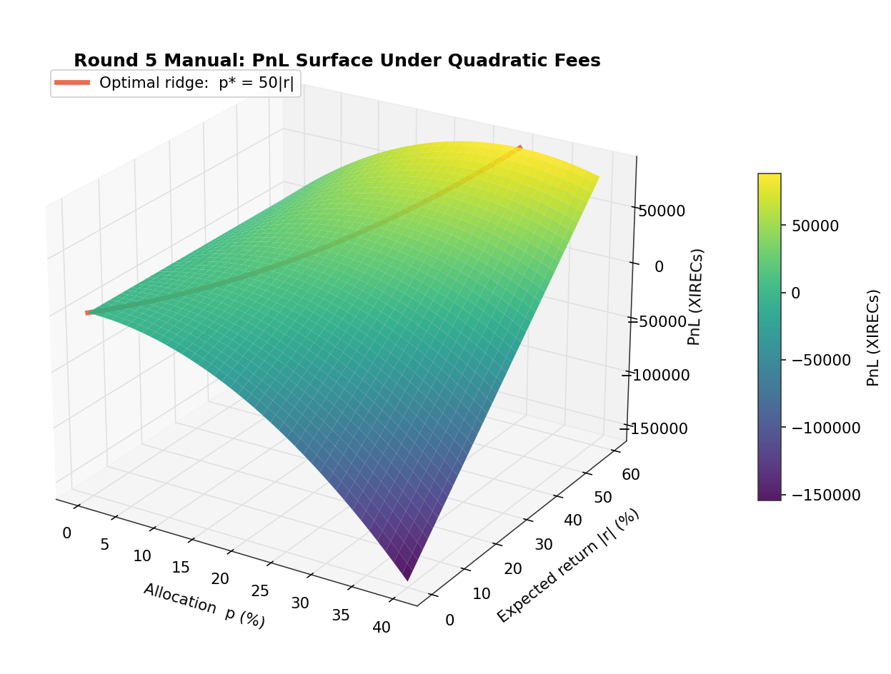
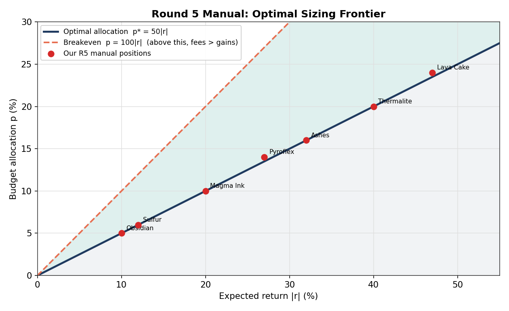
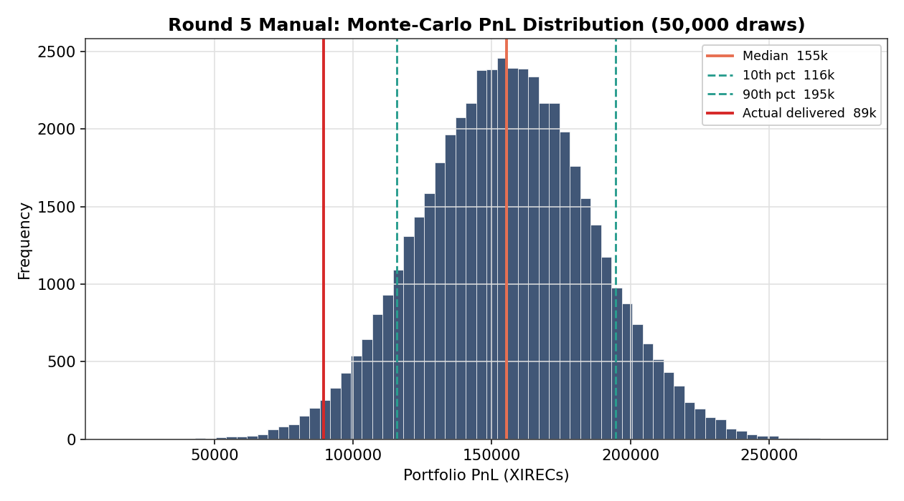

# 07 — Manual Rounds: The Math Behind Our Best Results

Our manual game was the strongest part of our competition: **R1 6th in the world**, R2 128th, R5 411th. Manual rounds are pure-skill puzzles — no algo-engine complexity to hide behind — so they reward clean problem formulation. Here's the reasoning behind the two most interesting ones.

---

## Round 1 — Currency-exchange optimization (6th globally)

**The puzzle:** convert holdings through a sequence of currencies using a fixed rate matrix, maximizing final value. The twist is that the optimal path isn't the naive greedy one — you have to search over conversion sequences.

**Our approach:**
- Treat it as an **optimal-path search** over the rate matrix (bounded-depth enumeration of conversion sequences).
- The product of rates along a path determines the payoff; the best path can involve "detour" conversions that look locally suboptimal.
- Cross-checked against a hand expected-value calculation (a discipline we adopted after an earlier solver gave a wrong upper bound).

**Result:** 87,897 vs a theoretical max of ~87,995 — within **0.1%**. **6th out of ~18,000 teams.**

The lesson that carried forward: *re-derive the payoff model from the prompt every time; never trust a prior round's solver blindly.*

---

## Round 5 — News portfolio under quadratic fees

**The puzzle:** 9 tradable goods, a 1,000,000 budget, a news feed, and a **quadratic transaction fee**:

```
fee(p) = (p / 100)² × 1,000,000 = 100 · p²        (p = allocation in %)
```

You choose BUY/SELL and an integer % of budget per good. PnL per good (if your direction is right):

```
PnL(p) = p · 10,000 · |r|  −  100 · p²
         └─ gross gain ─┘     └─ fee ─┘
```
where `r` is the good's 1-day return.

**The key insight — closed-form optimal sizing.** Differentiate and set to zero:

```
d/dp [ p·10000·|r| − 100·p² ] = 10000·|r| − 200·p = 0
⟹  p* = 50 · |r|
```

So the optimal allocation is 50× the expected return percentage, and the expected PnL at the optimum is `250,000 · r²`. Two consequences follow:

1. The quadratic fee enforces diversification. Going all-in on a single idea (say 50% allocation) is self-defeating — the fee grows as p² while gross gain grows only as p. The structure forces capital across many positive-expectancy positions.
2. No identifiable edge should be skipped. Any good with a directional read has `p* > 0`. This was the direct correction of the R4 mistake, where skipping "small-edge" trades left roughly $155K on the table.



The surface above plots `PnL(p, r) = p·10000·|r| − 100·p²`. The amber ridge traces the optimal allocation `p* = 50|r|` — the locus of maximum PnL for each expected return. The drop-off on the high-allocation side is the quadratic fee penalty; this is what makes over-concentration costly.



Projected onto two dimensions: the navy line is the optimal allocation, the amber dashed line is the breakeven boundary (`p = 100|r|`, above which fees exceed gross gain), and the red points are our actual submitted positions, each sized at its optimum.

**The full solve:**
1. **Read each article** for direction + magnitude, anchored to real-world analogues (a sales-halt food-safety scandal ≈ −45%; a 2.7× user-growth forecast ≈ +40%; a tax-doubling ≈ −25%).
2. **Spot the fade-tests.** Two articles were transparently-written "influencer pump" calls ("self-proclaimed market-medium," "follow my lead and make money"). Since IMC's game-makers are active traders who design these to reward recognizing manipulation patterns, we **shorted those small**.
3. **Apply `p* = 50|r|`**, then a **Lagrangian** to scale down if the allocations summed past 100%.
4. **Monte-Carlo** 50,000 draws over our return-estimate uncertainty → full PnL distribution (not a point guess). Result: 100% of simulated outcomes positive, median ~$155K.

**Result:** projected ~$155K (range $120–190K), delivered **$89,187**. The gap is the "wisdom of the crowd" correction — the organizers move actual returns toward the middle of their pre-defined range based on aggregate submissions, so magnitude estimates calibrated to the favorable end of each range landed conservatively. Rank 411 of 18,803.



The distribution above is 50,000 simulated outcomes drawing each product's return from its estimated uncertainty band. Every simulated outcome was positive; the delivered result sits below the modeled median, consistent with the crowd-correction mechanic pulling returns toward the center of each range.

The optimizer that produced this, with sensitivity and Monte-Carlo, lives in [`Manual Round 5/r5_manual_optimizer.py`](../Manual%20Round%205/).

---

## Why manual was our edge

Manual rounds reward exactly the skills that don't depend on the noisy algo fill-model: precise payoff modeling, optimization under constraints, game theory, and the discipline to derive the answer rather than guess it. Across five rounds, that's where we consistently punched above our overall ranking.

→ Next: [Pipeline Architecture](08-pipeline-architecture.md)
