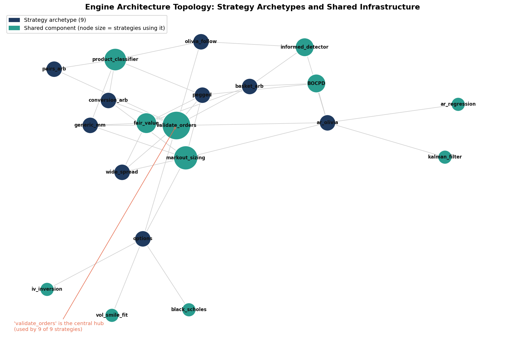

# 08. Pipeline Architecture

The system has two halves: a submission engine that must run inside the exchange's constraints, and an offline research-and-validation pipeline that has no such limits.

## Submission engine (`trader.py`)

A single self-contained file. The exchange disallows third-party libraries, so every model is implemented in pure Python and the engine must serialize all state into a sub-90KB string each tick.

The strategy archetypes are thin handlers over a shared core of infrastructure. The topology below shows the dependency structure: position-limit enforcement (`validate_orders`) is the universal hub, with fair-value estimation, markout sizing, and the product classifier as secondary hubs, while specialized components (Black-Scholes, IV inversion, the vol-smile fit) attach only to the strategies that need them.

### Strategy dispatch
Each product is routed to one of nine strategy handlers, either by an explicit per-product configuration or by a runtime classifier when an unconfigured product appears:

- `pegged`: stable-value market making: sweep all profitable resting liquidity, then post improved bid/ask one tick inside the book; throttle as inventory approaches the position limit.
- `ar_olivia`: AR(p) regression on returns plus a Kalman-filtered fair value, with an informed-counterparty detector biasing direction.
- `olivia_follow`: directional signal-following with no resting quotes (for products where passive quoting is adversely selected).
- `wide_spread`: EMA-anchored wide two-sided quoting for high-volatility products.
- `basket_arb`: z-score entry on the basket-minus-NAV premium with partial component hedging.
- `conversion_arb`: cross-market arbitrage incorporating environmental/observation factors.
- `options`: implied-vol scalping against a fitted vol smile, with a per-product kill switch.
- `pairs_arb`: cointegrated pairs trading.
- `generic_mm` / `do_nothing`: fallback market making, or an explicit sit-out for unclassifiable products.

**Known limitation: 7 of 9 archetypes are stubbed at dispatch.** Reading the actual dispatch block (`trader.py`, the `elif ptype == ...` chain) shows `ar_olivia`, `olivia_follow`, `wide_spread`, `basket_arb`, `conversion_arb`, `pairs_arb`, and even the literal `options` tag all resolve to `orders = []`, a no-op. Only `pegged` and the specific voucher handlers below are wired to real trading logic. This is not just "unused code": `classify_product_live()` is a real, statistically-grounded runtime classifier (AC1 autocorrelation, price-range %, spread width, basket-keyword and cointegration-pair detection) that can and does *actively assign* all seven stubbed types to an unrecognized product mid-competition, including assigning `options` to any newly-detected voucher/coupon/call/put product with a valid underlying. Had an unknown option-like product appeared live, the classifier would have correctly identified it and then silently traded nothing.

This never affected the actual competition results, because every product that mattered (ASH_COATED_OSMIUM, INTARIAN_PEPPER_ROOT, HYDROGEL_PACK, VELVETFRUIT_EXTRACT, and each VEV strike) was **statically** pre-configured in `CONFIG` before each round started, bypassing the classifier entirely:

- `pegged` → ASH_COATED_OSMIUM, INTARIAN_PEPPER_ROOT (R1), HYDROGEL_PACK, VELVETFRUIT_EXTRACT (R3/R4)
- `voucher_intrinsic_mm` → VEV_4000 (deep-ITM voucher MM at intrinsic, delta-hedged to the underlying)
- `otm_short` → VEV_5100–5500 (theta-decay short, sized per-strike from a computed decay table)
- `do_nothing` → VEV_4500, VEV_5000, VEV_6000, VEV_6500 (explicitly disabled after live/backtest evidence showed no edge)
- `generic_mm` → runtime fallback for auto-classified products the classifier could place a book on but not otherwise categorize
- Round 5 used a separate, purpose-built engine (`trader_r5.py`) entirely, not this dispatch table.

Three more real, non-stub, well-evidenced functions exist in the file: `skew_mm` (delta-hedged smile market-making), `mean_revert_mm` (deviation-sized mean reversion, built off a specific HYDROGEL_PACK diagnostic), and `voucher_chain_dir` (directional voucher positioning reverse-engineered from a competitor backtest), but none is assigned in the final static `CONFIG`, so it's unconfirmed whether they fired live versus being built, tested, and superseded during development.

### Core mathematical components (all stdlib)
- **Black-Scholes library**: normal CDF, call/put pricing, delta, vega, and Newton-style implied-volatility inversion.
- **AR(p) estimation**: ordinary least squares via a Cholesky solve of the normal equations.
- **Kalman filter**: per-product-type process/measurement noise (Q/R) tuning.
- **Bayesian Online Changepoint Detection**: monitors for regime shifts and halves position sizing when a changepoint is detected.
- **Markout tracking**: measures post-fill price movement to detect adverse selection and scale sizing down when fills are consistently unfavorable.

### Risk and safety
- **Trim-based position-limit enforcement**: when an order pack would breach a limit, the widest passive quotes are trimmed while aggressive takes are preserved, rather than nuking the entire pack.
- **Kill switches**: per-product PnL floors (e.g. −5K on options) that force inventory unwind.
- **State hygiene**: `traderData` is pruned to stay under the size limit; rolling buffers are capped while preserving enough history for each model's window.

## Offline research and validation pipeline

Standard scientific Python is permitted offline (it never ships), so the research tooling uses numpy/pandas/matplotlib freely. The pipeline's job is to decide what is real before it reaches the engine.

### Backtesting
- **Integrated backtester**: reconstructs the order book tick by tick from historical price data, runs the actual `Trader` class against it, simulates fills through book depth, and reports per-product PnL. This is the ground-truth check.
- **Per-round backtester**: replays specific rounds for regression testing.

### Validation
- **Walk-forward validation**: selects a configuration on a training subset of days, then evaluates it on a held-out day. A signal that only survives in-sample is rejected.
- **Regression gauntlet**: replays prior rounds against the current engine and aborts the ship if any product regresses beyond a tolerance versus a blessed baseline.
- **Quality gates**: pre-submission checks: file size under 100KB, valid JSON state, position-limit safety, graceful handling of empty order books.

### Signal research
A toolkit for separating alpha from noise, used heavily in Round 5's 50-product search:
- Cross-asset and within-category return-correlation matrices.
- Lead-lag detection via cross-correlation at multiple offsets.
- Order-book-imbalance studies.
- Hurst-exponent and half-life estimation for mean-reversion vs trending classification.
- Time-of-day PnL attribution.
- Monte-Carlo PnL distribution modeling for the manual rounds.

## Design principle

The engine is deliberately conservative (explicit sit-outs, kill switches, trim-not-nuke order handling) because the dominant failure mode in this competition was not missing upside but taking unhedged or overfit risk into an unseen market. The validation pipeline exists to enforce that a strategy earns its place across multiple regimes before it is trusted with capital. The one round where that discipline was bypassed (Round 4) is documented in [Overfitting Analysis](09-overfitting-lessons.md).
