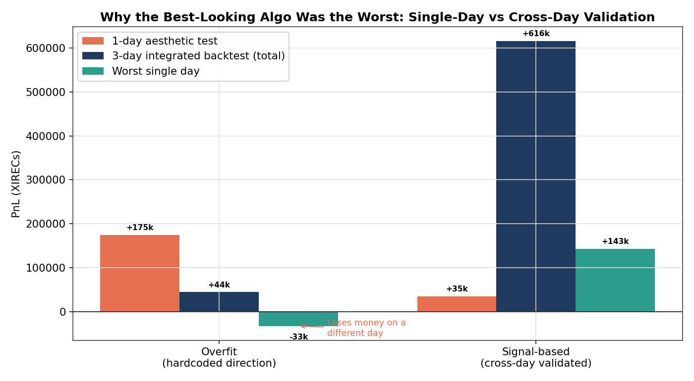
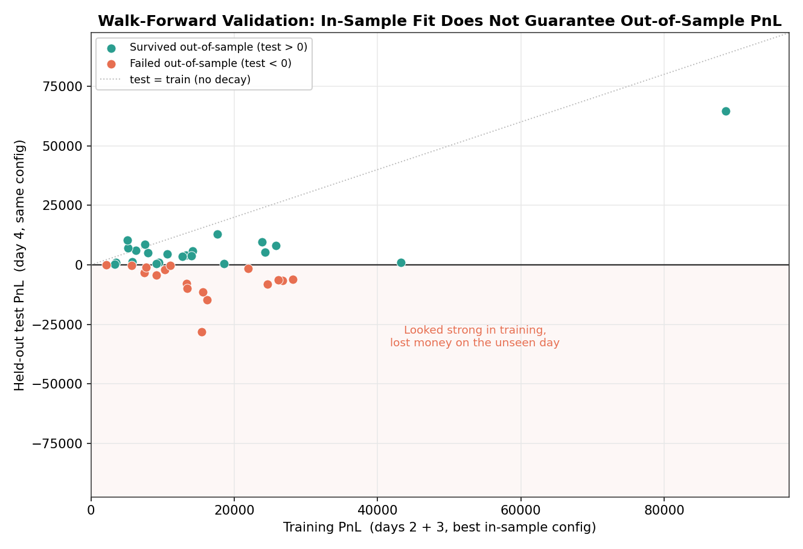

# 09 — Overfitting Analysis

The single most important finding of the competition, stated plainly: **a strategy calibrated to the direction of one observed day is not a signal — it is a bet that the next day looks like the last one.** This appeared twice, cost the most PnL of any error, and is the clearest transferable lesson from the work.

## The mechanism

The algorithmic rounds are scored on an unseen day of market data. Teams are given several historical days to develop against. The trap is to fit a model to the specific price path of the development data — its drift direction, its exact mean-reversion levels, its volatility — and assume the scoring day reproduces it.

It does not. Across the three Round 5 development days, market-making PnL on identical configuration varied by 2–4×, and directional drift on individual products changed sign from one day to the next. A model that depends on a particular day's direction has no reason to generalize.

## Round 4: the failure in full

We shipped an algorithm that added deep-in-the-money short option positions on top of spot market-making. The thesis required the underlying to drift in a particular direction so the short options would decay toward intrinsic value.

- Backtested against the available day: projected ~$130,000.
- Delivered on the unseen scoring day: **$19,664.**

On the development day the underlying drifted down monotonically and the thesis worked. On the scoring day the underlying barely moved on net but spiked intraday, driving the short option book through large mark-to-market drawdowns (one strike: peak +$7,633, trough −$20,991, close −$5,781). Simultaneously, the supposedly-reliable market-making products returned roughly half their backtested PnL — pure single-day variance on identical code.

The error was not the options thesis itself; it was sizing it as if the development day's direction was a law.

## Round 5: the failure caught before shipping

In the final round the same pattern reappeared in candidate algorithms — but this time the validation pipeline caught it.

One teammate produced several candidates that hardcoded long/short directional positions calibrated to a single observed day. One candidate's own source comment read "Strategy is calibrated to this known market." On the one-day aesthetic test these scored as high as $174K. Run through the three-day integrated backtester, the picture inverted:

| Candidate | One-day aesthetic | Three-day backtest (total) | Worst single day |
|-----------|-------------------|----------------------------|------------------|
| Hardcoded direction | $174,603 | +$44,486 | **−$33,050** |
| Cross-day validated | $34,505 | **+$615,749** | **+$143,139** |

The candidate that looked best on the single-day test lost money on a different day. The candidate that looked weakest on the single-day test was the only one robust across all three. We recommended the cross-day-validated version.

## The evidence, generalized

The same effect is visible across the entire Round 5 product set, not just the two candidate algorithms. Taking the best in-sample configuration for each product (selected on days 2 and 3) and evaluating it unchanged on the held-out day 4 produces this:

Each point is a product. The horizontal axis is training PnL; the vertical axis is held-out test PnL with the same configuration. A large fraction of products with strong training PnL fall into the shaded region — they made money in-sample and lost it on the unseen day. The survivors (above zero) are the only configurations worth shipping, and they are not the ones with the highest training PnL. This is the quantitative basis for the validation rules below.

## The discipline that resulted

After Round 4, every algorithmic decision was gated on cross-day evidence:

1. **A signal must be positive across all available development days**, not just one. One negative or near-zero day disqualifies it.
2. **Walk-forward validation** — tune the configuration on a training subset, then confirm it still profits on a held-out day. In-sample-only performance is treated as noise.
3. **Distrust the one-day aesthetic test.** It measures fit to a single slice, which is exactly the quantity that does not generalize.
4. **Prefer adaptive signals over directional bets.** A z-score mean-reversion rule responds to whatever the market does; a hardcoded long/short bet assumes the market repeats. The former degrades gracefully; the latter inverts.

## The honest coda

Even with this discipline, the Round 5 algorithm delivered only +$6,849 on the live day. The validated mean-reversion approach has its own genuine failure mode — it gives back PnL on strongly trending days — and three development days is a thin statistical jury. The lesson is not that cross-day validation guarantees success; it is that single-day calibration guarantees fragility, and the gap between those two is the difference between a controlled loss and a blow-up.

The manual side, where every position was sized from an explicit model rather than fitted to observed data, was consistently the stronger track. That contrast is itself the argument for model-first over fit-first.
