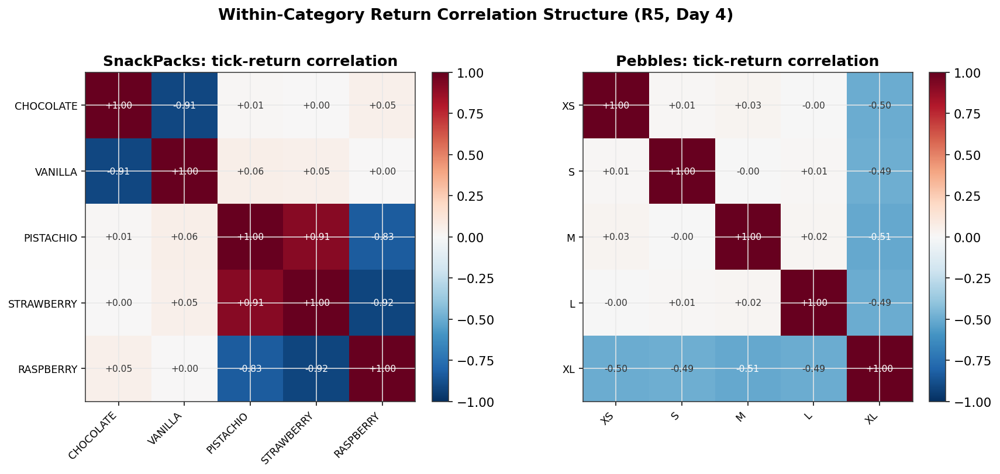
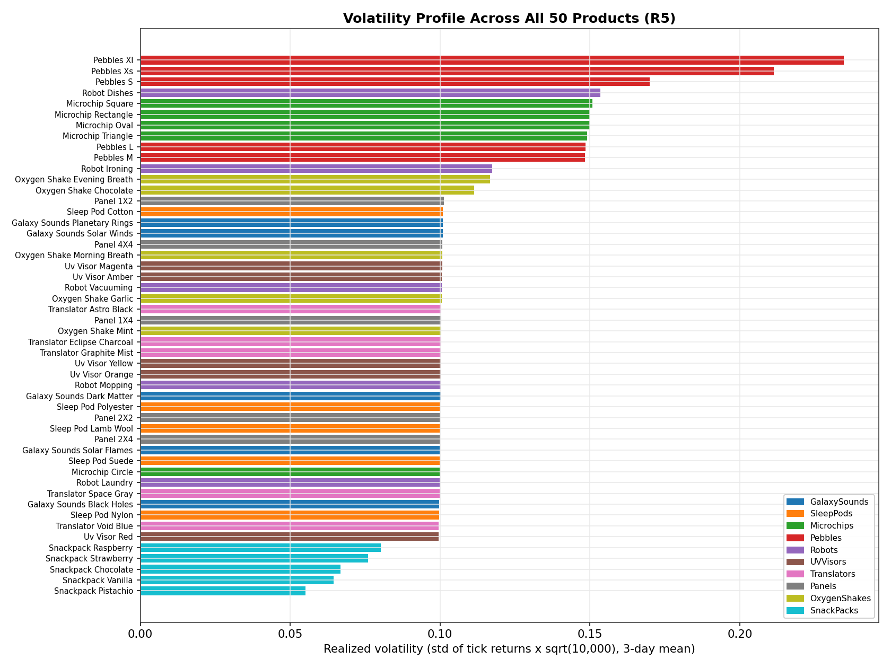
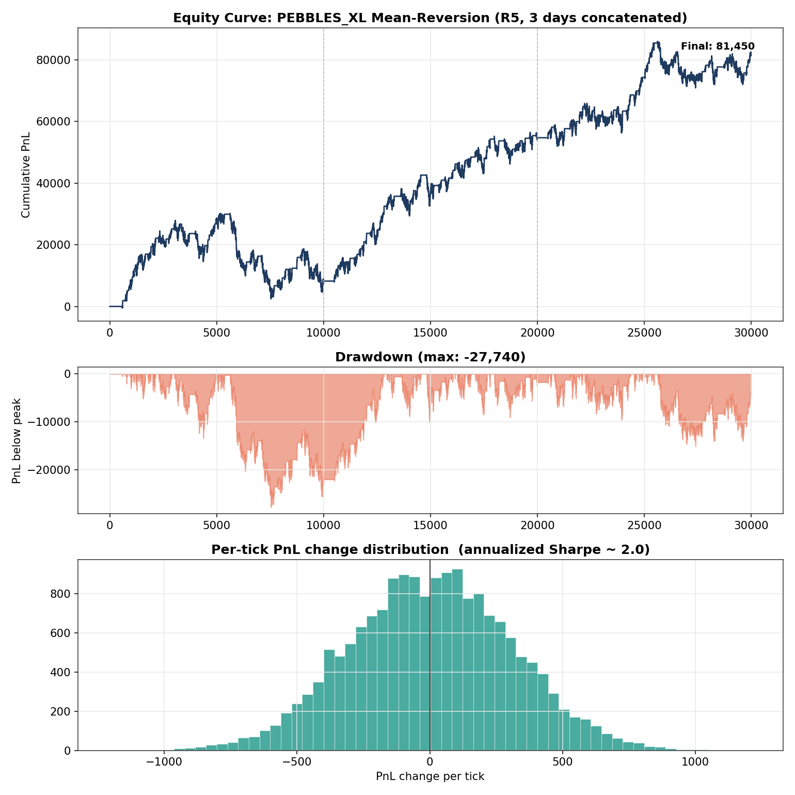
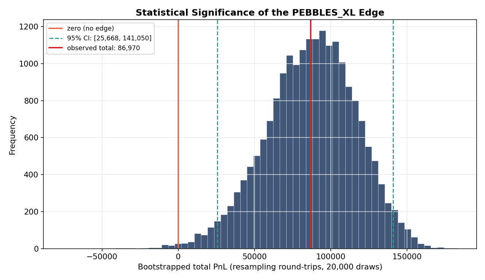
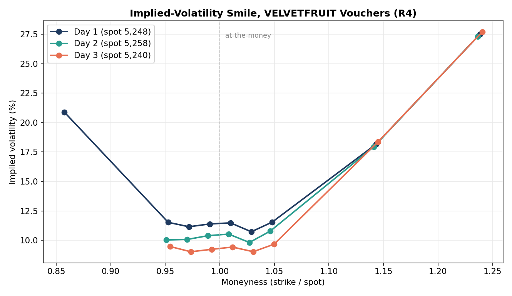
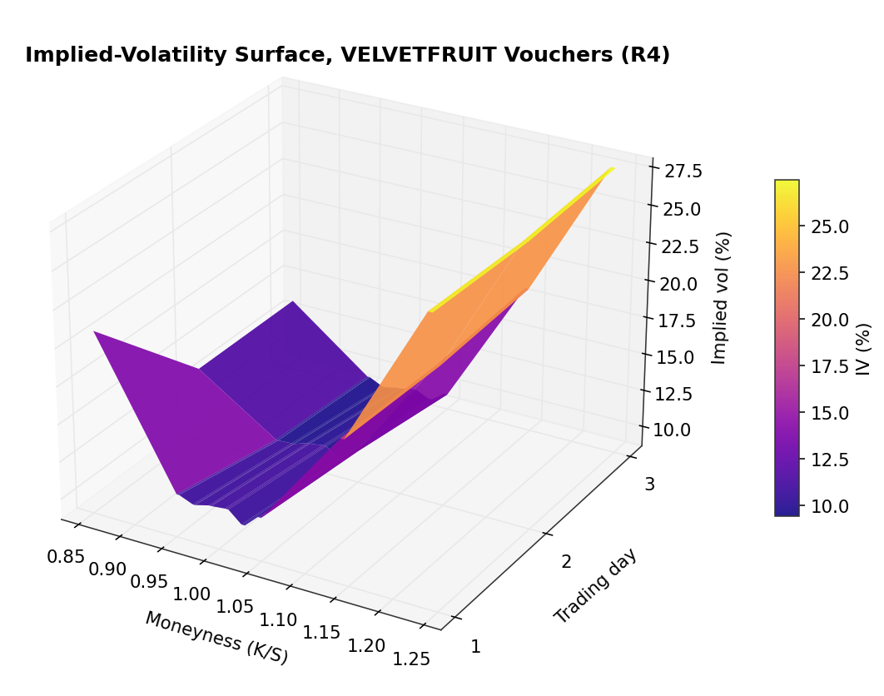

# 11. Quantitative Analysis

This page collects the analytical work that underpinned the strategies, with figures generated directly from the competition data ([`analysis/generate_quant_charts.py`](../analysis/generate_quant_charts.py)). It covers the four questions that drove every decision: *what moves together, what moves how much, where does the edge live, and what is the risk.*

## Correlation structure: what moves together

The Round 5 signal hunt began with the question of whether the 50 products had exploitable cross-sectional structure. Tick-return correlation matrices, computed per category, answered it immediately.

Two categories showed strong, cross-day-stable structure:

- **SnackPacks** decompose into two independent factor pairs. Chocolate and Vanilla are near-perfect mirrors (−0.91); Pistachio and Strawberry move together (+0.91) and both oppose Raspberry (−0.83 to −0.92). This is a clean two-factor system, exactly the structure a relative-value strategy is built on.
- **Pebbles** are dominated by a single factor: PEBBLES_XL is anti-correlated (≈ −0.50) with every other size, while the other four are mutually uncorrelated. XL is effectively the category's index leg.

The other eight categories showed near-zero within-category correlation, and a separate 50×50 analysis found no stable *cross*-category structure. That negative result was as valuable as the positive one: it ruled out a large class of strategies and focused effort on the two categories that mattered.

## Volatility profile: what moves how much

Realized volatility across all 50 products set the sizing and strategy-selection priors. Position limits are uniform (10 per product), so volatility, not notional, governs risk contribution.

The spread is wide: the most volatile products move several times more per tick than the calmest. High-volatility, mean-reverting products (the Pebbles leg, several Microchips) are where z-score reversion earns the most per round-trip; low-volatility products barely clear the bid-ask cost and were largely left alone.

## Where the edge lives: the parameter surface

For the headline mean-reversion alpha (PEBBLES_XL), the strategy has two free parameters: the rolling window for the z-score and the entry threshold. Sweeping both across all three days produces a PnL surface.

The surface is smooth and has a broad plateau rather than a single sharp spike. That matters: a broad optimum means the strategy is not balanced on a knife-edge of parameter values that happened to work on the development data. A sharp, isolated peak would have been a warning sign of overfitting, the same failure mode that cost us Round 4 ([Overfitting Analysis](09-overfitting-lessons.md)). The shipped configuration sits inside the plateau, not on the peak, deliberately trading a little in-sample PnL for out-of-sample robustness.

## Risk: equity, drawdown, distribution

PnL alone is not a risk picture. The equity curve, drawdown profile, and per-tick PnL distribution for the PEBBLES_XL strategy (concatenated across the three days) give the full view.

- **Equity curve**: steady accumulation rather than a few lucky jumps, which is the signature of an edge that recurs rather than a one-off. Final cumulative PnL across the three concatenated days: **81,450**.
- **Drawdown**: max peak-to-trough excursion: **−27,740**. Relative to the final PnL that looks contained (~34%), but that comparison flatters it: the worst drawdown happens mid-series (around tick 7,500), where it erases roughly 80–90% of the profit accumulated *up to that point* before the strategy recovers. Read it as "the strategy survives a near-total mid-run giveback and keeps compounding afterward," not as "drawdowns are consistently small."
- **Return distribution**: centered positive with controlled tails. Annualized Sharpe **≈ 2.0**.

## Is the edge real, or luck?

A total PnL is a point estimate; it does not say whether the edge is statistically distinguishable from zero. Resampling the strategy's per-round-trip PnLs with replacement (a bootstrap) builds a confidence interval on the total.

Across the three days, the PEBBLES_XL mean-reversion strategy made an observed +86,970 over 120 round-trips. The bootstrap 95% confidence interval is [+25,668, +141,050], and the probability of a non-positive total is **0.36%**. The lower bound sits well above zero: the edge is statistically significant, not a lucky run. This is the kind of evidence that should precede sizing real capital into any signal.

## Options: the volatility smile and surface

Rounds 3 and 4 introduced option (voucher) products. Inverting Black-Scholes on the market mid prices recovers the implied-volatility smile across strikes, the foundation of the options market-making strategy.

The smile is well-formed and stable across the three days: implied vol rises away from at-the-money, with a pronounced skew toward out-of-the-money calls. The options strategy traded *relative* mispricing (strikes whose implied vol deviated from the fitted smile) rather than absolute price, which is the standard way to avoid taking an unintended directional or vega position.

Extending across the three days gives the surface:

## What the analysis bought us

Each figure maps to a decision: the correlation structure selected *which* products to trade relationally, the volatility profile set *how large*, the parameter surface chose *robust* settings over peak settings, the risk panel confirmed the edge was recurring rather than lucky, and the vol smile framed the options book as a relative-value rather than directional play. The discipline throughout (preferring broad optima, cross-day stability, and bounded drawdown over headline in-sample PnL) is the direct lesson of [Round 4](05-round4.md).
